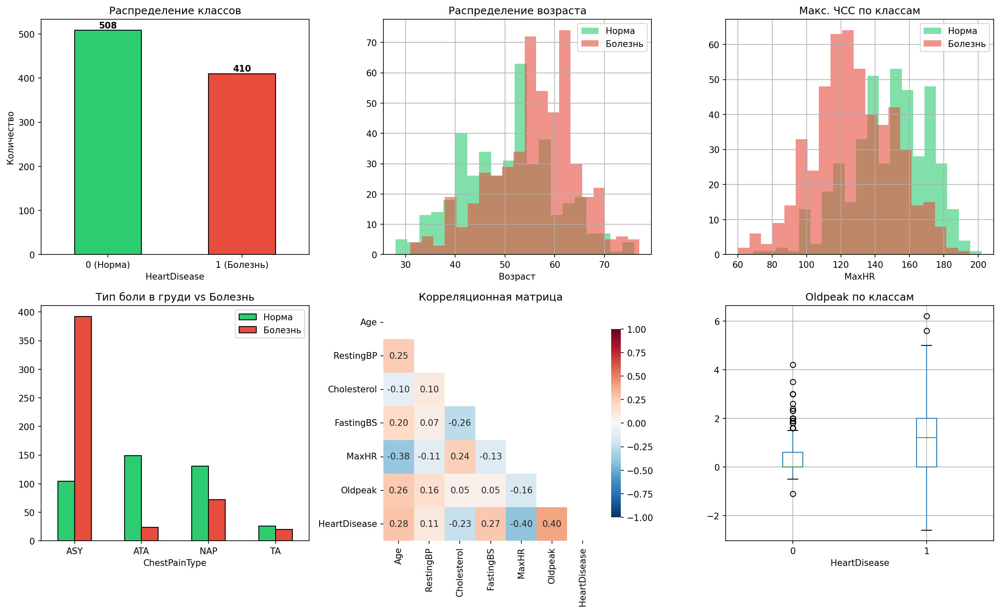
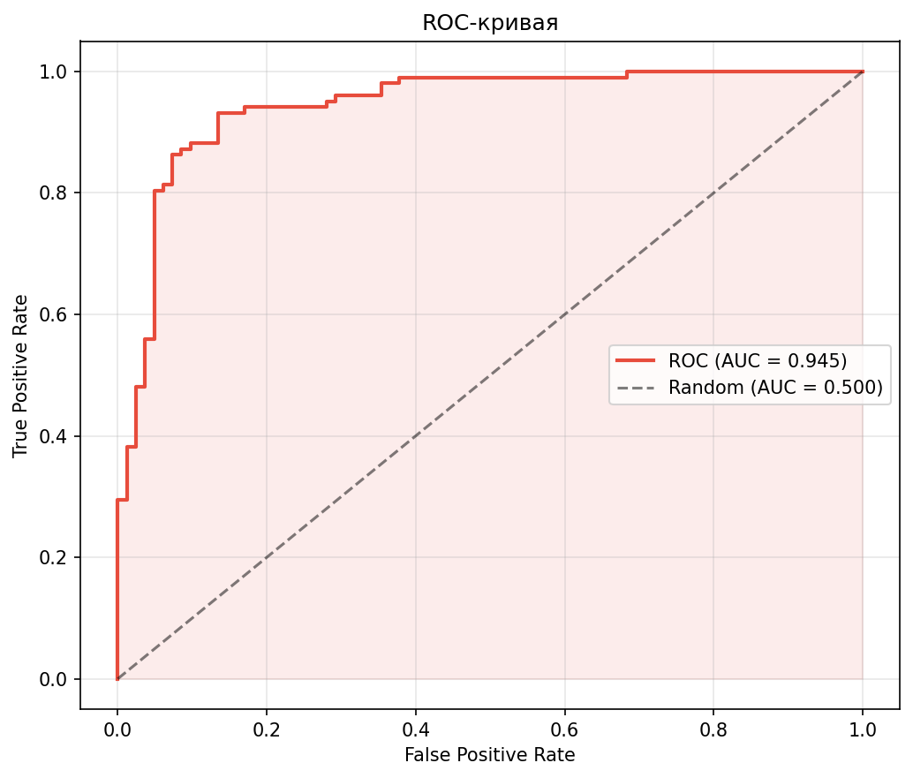
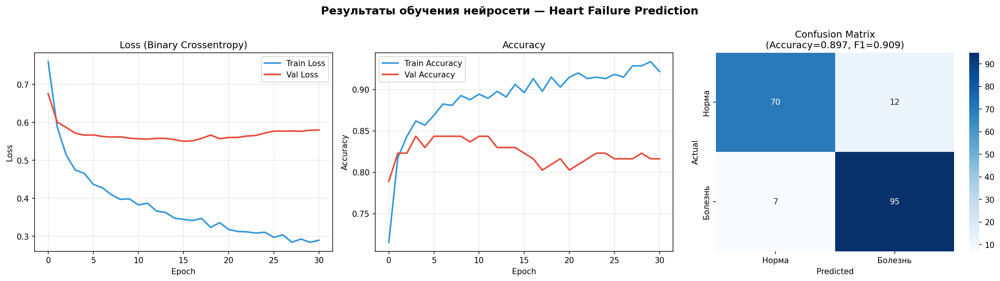
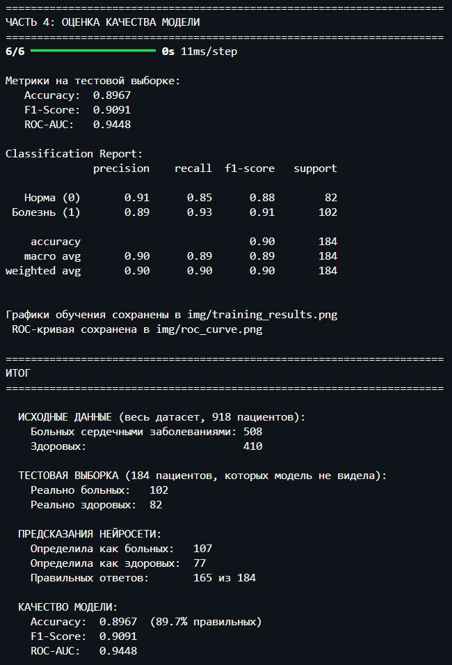

# Задача на классификацию

## Цель

Найти открытый датасет, описать практическую задачу с понятным прикладным смыслом и обучить нейронную сеть на Keras.

---

## Шаги выполнения

### 1. Датасет

Найди подходящий открытый датасет для задачи классификации, например на [Kaggle Datasets](https://www.kaggle.com/datasets).

### 2. Постановка задачи

Выбери и опиши **практическую задачу классификации** с понятным прикладным смыслом.
Может быть бинарная или мультиклассовая классификация.

### 3. Реализация

Напиши и обучи нейросеть на Keras, проверь её на тестовой выборке:

| Этап | Описание |
|------|----------|
| **Анализ данных (EDA)** | Что за данные, какие классы, есть ли дисбаланс |
| **Подготовка данных** | Кодирование, нормализация, разбивка на train/test |
| **Выбор модели** | Классический ML или нейросеть в зависимости от задачи |
| **Обучение и оценка** | Обучи модель и оцени качество с помощью адекватных метрик |

---

## 4. Реализованная задача

**Предсказание сердечной недостаточности** — бинарная классификация пациентов на основе клинических показателей:

- возраст, пол, тип боли в груди
- артериальное давление, холестерин, уровень сахара
- результаты ЭКГ, максимальная ЧСС, стенокардия

Данные взяты на [Kaggle Datasets Heart Failure Prediction](https://www.kaggle.com/datasets/fedesoriano/heart-failure-prediction?resource=download).

**Целевая переменная:** `HeartDisease` — `1` (есть заболевание) / `0` (здоров)

### 4.1 Результаты

| Метрика | Значение |
|---------|----------|
| Accuracy | см. `training_results.png` |
| ROC AUC | см. `roc_curve.png` |

### 4.2 Графики

| EDA | ROC-кривая | Обучение |
|-----|-----------|---------|
|    |    |    |

### 4.3 Пример итогов запуска программы



---

## 5. Файлы проекта

```
ml_course/
├── main.py          # Полный код: EDA → предобработка → модель → оценка
├── heart.csv        # Датасет (918 пациентов, 12 признаков)
└── img/
    ├── eda_analysis.png      # Анализ данных
    ├── roc_curve.png         # ROC-кривая
    └── training_results.png  # График обучения
```
